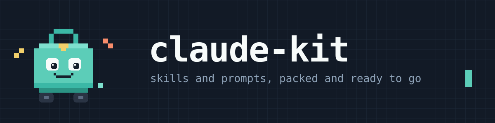

# Claude Kit

My Claude Code skills, reusable prompts, and hooks.

| Directory | What's in it | How it's used |
| --- | --- | --- |
| [`skills/`](skills) | Agent skills (`SKILL.md`) | Symlinked into a skills directory |
| [`prompts/`](prompts) | Reusable prompt text | Copied and pasted — chat, API, any model |
| [`hooks/`](hooks) | Tool-call guards (Bun scripts) | Copied into `~/.claude/hooks` and registered in `settings.json` |

## Skills

| Skill | Description |
| --- | --- |
| [`artifact-theme`](skills/artifact-theme/SKILL.md) | House visual identity for artifacts and standalone HTML pages — palette, typefaces, layout, and the looks to avoid. Includes a teal, elevation-over-borders theme as a starting point — replace it with your own. |
| [`commit`](skills/commit/SKILL.md) | Group uncommitted changes into atomic commits, one per purpose, flagging anything not touched in the current session before staging it. |
| [`discuss`](skills/discuss/SKILL.md) | Critical discussion mode — no code, no implementation, no file changes. For debating architecture, weighing tradeoffs, or thinking through a decision before implementing. Manual invocation only (`/discuss`). |
| [`git-summary`](skills/git-summary/SKILL.md) | Bullet-point summary of the current branch — what its commits accomplish, what's still uncommitted, and any loose ends — measured against the default branch. |
| [`merge-from`](skills/merge-from/SKILL.md) | Merge a target branch (default: `main`/`master`) into the current feature branch and resolve conflicts, preserving the feature branch's intent through structural changes like renames. |
| [`recall`](skills/recall/SKILL.md) | Load feature context saved by `remember` from previous sessions, so a resumed feature starts with its prior decisions, corrections, and gotchas instead of a cold codebase search. |
| [`remember`](skills/remember/SKILL.md) | Save a dated, ADR-style feature record — decisions, corrections, key file roles, gotchas, deferred work — into the session's auto-memory directory for future sessions to pick up. |
| [`translate-files`](skills/translate-files/SKILL.md) | Fill missing keys in Laravel `lang/*.php` files across supported languages, preserving placeholders, pluralization, HTML, and a do-not-translate brand term list. Configure `references/brand-terms.md` per project. |

Copy or symlink a skill folder into your skills directory:

```bash
# personal, available in every project
ln -s "$PWD/skills/discuss" ~/.claude/skills/discuss

# or project-scoped
ln -s "$PWD/skills/discuss" /path/to/project/.claude/skills/discuss
```

Then invoke it in Claude Code:

```
/merge-from            # merge the repo's default branch into this one
/merge-from develop    # merge a named branch instead
```

### Enabling `artifact-theme`

This skill is not loaded automatically. Add this line to your global `~/.claude/CLAUDE.md`:

```markdown
Before building any artifact or standalone HTML page, read
`~/.claude/skills/artifact-theme/SKILL.md` and use its tokens.
```

Then replace the palette, typefaces, and layout in the skill with your own.

## Prompts

### Post-spike review lenses (`prompts/review/`)

Five sibling prompts, one lens each. Run one or several at the end of a spike; all return the same `implement` / `recommend` / `skip` verdict so the outputs read alike.

| Prompt | Lens |
| --- | --- |
| [Data structure & architecture](prompts/review/data-structure-architecture.md) | A data structure or organizing model that would materially simplify the code. Adapted from [Aaron Francis's original](https://x.com/aarondfrancis/status/2075349771900899627). |
| [Test quality](prompts/review/test-quality.md) | Test gaps, over-mocking, or brittle assertions that give false confidence. |
| [Performance & queries](prompts/review/performance-queries.md) | N+1s, missing indexes, unbounded work, payload bloat — costs that grow with data or traffic. |
| [Error handling & resilience](prompts/review/error-handling-resilience.md) | Missing failure paths, swallowed errors, races, retry and timeout gaps, partial-failure states. |
| [Naming & readability](prompts/review/naming-readability.md) | Misleading names, hidden intent, spike leftovers, avoidable cognitive load. |

### Standalone

| Prompt | Use |
| --- | --- |
| [Audit your codebase](prompts/audit-codebase.md) | Whole-codebase, read-only, multi-agent audit of data structures, state, and ownership. By [Aaron Francis](https://x.com/aarondfrancis/status/2088285625946370352). The codebase-wide counterpart to the data-structure review lens. |

### Solo (`prompts/solo/`)

Prompts that assume the [Solo](https://soloterm.com) MCP server is available.

| Prompt | Use |
| --- | --- |
| [Blind spot discovery](prompts/solo/blind-spot-discovery.md) | Evaluation and blindspot pass on one feature — what's done well, what could be better, and the unknown unknowns — ending with an interview on what would change its recommendations. Writes the report to a Solo scratchpad. Adapted from [Thariq's original](https://x.com/trq212/status/2073100352921215386). |
| [Compact instructions](prompts/solo/compact-orchestrator.md) | What an orchestrator session must carry into its compaction summary — process registry, todos, timers, locks, rulings, verification ledger — so orchestration resumes with no re-discovery. |
| [Orchestration](prompts/solo/orchestration.md) | Coordinate independent Solo work lanes and land one bounded slice at a time, with a plan-approval gate. Claude-agent version adapted from [Aaron Francis's original](https://x.com/aarondfrancis/status/2080691008979734826), which used Codex and Amp. |

Each file has a title and one-line description above a `---` rule; paste everything below the rule.

Prompt text meant to run somewhere Claude Code isn't — pasted into a chat window, an API call, or another model. Anything only ever used inside Claude Code belongs in `skills/` instead, so it can be invoked rather than retyped.

## Hooks

Scripts Claude Code runs around tool calls. They need [Bun](https://bun.sh) on the path, and each exits `0` on any internal error so a bug in the hook never gets in the way.

| Hook | Event | What it does |
| --- | --- | --- |
| [`safety-guard`](hooks/safety-guard/safety-guard.ts) | `PreToolUse`, every tool | Stops the agent from running destructive actions or touching secrets. Each rule is a regex in a named group at the top of the file, so adding or removing one is a one-line change. |
| [`comment-budget`](hooks/comment-budget/comment-budget.ts) | `PreToolUse`, `Bash` | Keeps prose comments out of committed code. Intercepts `git commit`, lexes the diff of what would be committed, and blocks with the offending lines listed. Override one commit with `COMMENT_BUDGET_OK=1 git commit ...`. |

### `safety-guard` rules

| Group | Blocked |
| --- | --- |
| Recursive or forced deletes | `rm` with `-r`/`-R`/`-f` in any combination, `rmdir`, and recursive `rm` aimed at `/`, `~`, `$HOME`, `..`, `.`, or a bare `*` |
| Delete workarounds | `find -delete`, `find -exec rm`, `xargs rm`, `trash`, `mv` into `/tmp` |
| Scripted deletes | Perl `unlink`/`rmtree`, Python `shutil.rmtree`/`os.remove`/`os.unlink`, Ruby `FileUtils.rm_rf` |
| Database wipes | Laravel `migrate:fresh`, `migrate:refresh`, `migrate:reset`, `db:wipe` |
| Secrets | Reading, editing, copying, moving, or sourcing any `.env` file, via file tools or shell. `.env.example`, `.env.sample`, and `.env.template` are allowed |

### `comment-budget` scope

Covers PHP, JS/TS, Vue, and Blade. Strings, regex literals, and heredoc bodies are lexed rather than pattern-matched, so a `//` inside a URL is not a comment. Type annotations (`@param`, `@return`, ...) and tooling directives (`@ts-ignore`, `eslint-disable`, `phpcs:`) are exempt.

Copy the scripts into your hooks directory and register them in `~/.claude/settings.json` (see [`hooks/settings.example.json`](hooks/settings.example.json)):

```bash
mkdir -p ~/.claude/hooks
cp hooks/safety-guard/safety-guard.ts hooks/comment-budget/comment-budget.ts ~/.claude/hooks/
```

## License

[MIT](LICENSE), except the third-party prompts in `prompts/`, which remain the work of their credited authors.
